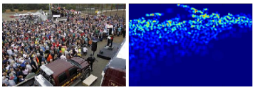

# Crowd Counting

This is an overview about crowd counting. In this repository, you can learn how to estimate number of pedestrians in crowd scenes through computer vision and deep leaning.

## How to do crowd counting?
Crowd counting has a long research history. About twenty years ago or even earlier, researchers have been interested in developing the method to count the number of pedestrians in the image automatically.  
There are mainly three categories of methods to count pedestrians in crowd. 
1. Pedestrian detector. You can use traditional HOG-based detector or deeplearning-based detector like YOLOs or RCNNs. But effect of this category of methods are seriously affected by occlusion in crowd scenes. 
2. Number regression. This category of methods just capture some features from original images and use machine-learning models to map the relation between features and numbers. An improved version via deep-learning directly map the relation between original image and its numbers. Before deep-learning, regression-based methods were SOTA and researchers are focus on finding more effective features to estimate more accuracy results. But when deep-learning get popular and achieve better results, regression-based methods get less attention because it is hard to capture effective hand-crafted features. 
3. **Density-map**. This category of methods are the mainstream methods in crowd counting nowadays. Compared with detector-based methods and regression-based methods, density-map can not only give the information of pedestrian numbers, but also can reflect the distribution of pedestrians, which can make the models to fit original images with opposite density better.

## What is density-map?
Simply speaking, we use a gaussian kernel to simulate a head in corresponding position of the original image. After do this action for all heads in the image, we then perform normalization in matrix which is composed by all these gaussian kernels. The sample picture is as follows:  
  
Further, there are three strategies to generate density-map.  
1. *Fixed-size density map*. Use the same gaussian kernel to simulate all heads. This method applies to scene without severe perspective distortion. [[fixed_kernel_code]](./generate_density_map/same_gaussian_kernel.py)  
2. *Perspective density map*. Use the perspective map(which is generated by linear regression of pedestrians' height) to generate gaussian kernels with different sizes to different heads. This method applies to fixed scene. [[perspective_kernel_code]](./generate_density_map/perspective_gaussian_kernel.py) And [[paper-zhang-CVPR2015]](https://www.ee.cuhk.edu.hk/~xgwang/papers/zhangLWYcvpr15.pdf) give detailed instruction about how to generate perspective density-map.  
3. *KNN density map*. Use the k-nearest heads to generate gaussian kernels with different sizes to different heads. This method applies to very crowded scenes. [[k_nearset_kernel_code]](./generate_density_map/k_nearest_gaussian_kernel.py) And [[paper-MCNN-CVPR2016]](https://pdfs.semanticscholar.org/7ca4/bcfb186958bafb1bb9512c40a9c54721c9fc.pdf) give detailed instruction about how to generate k-nearest density-map.  

## DataLoader for load image and its corresponding density-map
When finish generating density-maps, we need to program a dataloader to load image and its corresponding density-map for forward and backward propagation every batch. For images with same resolution, we can use batch_size=32 or 64 or even larger. Otherwise, we just use batch_size=1. We strongly recommend to use [torch.utils.data.Dataset](https://pytorch.org/docs/stable/data.html#torch.utils.data.Dataset) and [torch.utils.data.DataLoader](https://pytorch.org/docs/stable/data.html#torch.utils.data.DataLoader) to realize your own dataloader. An example code for how to contrust an dataloader is in [[dataloader_example_code]](./dataloader/dataloader_example.py).

## Deep-learning model for crowd counting
For beginner, [[paper-MCNN-CVPR2016]](https://pdfs.semanticscholar.org/7ca4/bcfb186958bafb1bb9512c40a9c54721c9fc.pdf) is the most suitable model to learn crowd counting. The model is not complex and have an acceptable accuracy. We provide an easy [[MCNN_model_code]](./crowd_model/mcnn_model.py) to let you know MCNN rapidly and an easy full realization of [[MCNN-pytorch]](https://github.com/CommissarMa/MCNN-pytorch).  
If you want more accuracy result, [[paper-CSRNet-CVPR2018]](https://arxiv.org/abs/1802.10062) is a deeper model for crowd counting. It uses dilated convolution to avoid the frequent pooling and upsample. We provide an easy full realization of [[CSRNet-pytorch]](https://github.com/CommissarMa/CSRNet-pytorch).

## Some Crowd-counting Dataset
+ UCSD：we provide an processed version with images and point annotations like other crowd-counting dataset.
Link：https://pan.baidu.com/s/1rykWyMYHMLr99W5CCEXeBQ 
Extraction code：4u66 (But I haven't achieved the same performance as showed in [[paper-MCNN-CVPR2016]](https://pdfs.semanticscholar.org/7ca4/bcfb186958bafb1bb9512c40a9c54721c9fc.pdf)
+ JHU Crowd++ Dataset: A comprehensive dataset with 4,372 images and 1.51 million annotations. In comparison to existing datasets, the proposed dataset is collected under a variety of diverse scenarios and environmental conditions. In addition, the dataset provides comparatively richer set of annotations like dots, approximate bounding boxes, blur levels, etc. [JHU Crowd++ dataset](https://drive.google.com/drive/folders/1FkdvHyAom1B2aVj6_jZpZPW01sQNiI7n) (https://crowd-counting.com)

## Some Tricks
+ use data augumentation such as horizontal flip, crop, illumination change, etc.

## Other Crowd Counting Branch
Multi-view crowd counting [[link]](./multi_view_counting/多视角计数调研.md)

## Inital steps for running the crowdcount code
Create virtual environment
```shell
python3 -m venv venv
source ./venv/bin/activate
pip install -r requirements.txt
```

Download [JHU Crowd++ dataset](https://drive.google.com/drive/folders/1FkdvHyAom1B2aVj6_jZpZPW01sQNiI7n) and extract into `./jhu_crowd_v2.0` path

For starting the training run
```shell
python -m crowdnet.train
```

For inference run
```shell
python -m crowdnet.predict --model-path MODEL_PATH --img-path IMAGE_PATH
```

[Download pretrained weights](https://drive.google.com/file/d/1YFxRZOiH3g5wOTj4vXCLxBSOqJknyuPk/view?usp=sharing)

# References

[1] Reza Bahmanyar, Elenora Vig, Peter Reinartz.2019. MRCNet: Crowd Counting and Density Map Estimation in Aerial and Ground Imagery.\url{https://arxiv.org/pdf/1909.12743.pdf}\\

[2] Yingying Zhang, Desen Zhou, Siqin Chen, Shenghua Gao, Yi Ma.2016.Single-Image Crowd Counting via Multi-Column Convolutional Neural Network.\url{https://zpascal.net/cvpr2016/Zhang_Single-Image_Crowd_Counting_CVPR_2016_paper.pdf}\\

[3] Martin Ester, Hans-Peter Kriegel, Jiirg Sander, Xiaowei Xu.1996.A Density-Based Algorithm for Discovering Clusters
in Large Spatial Databases with Noise.\url{https://www.aaai.org/Papers/KDD/1996/KDD96-037.pdf}\\

[4] Di Kang, Zheng Ma.2018.Beyond Counting: Comparisons of Density Maps for Crowd
Analysis Tasks - Counting, Detection, and Tracking.\url{http://visal.cs.cityu.edu.hk/static/pubs/journal/tcsvt18-denscnn.pdf}\\

[5] Peiyun Hu, Deva Ramanan. Finding Tiny Faces. \url{https://arxiv.org/abs/1612.04402}\\

[6] Richard Dosselmann, Xue Dong Yang. A comprehensive assessment of the structural similarity index. \url{https://link.springer.com/content/pdf/10.1007\%2Fs11760-009-0144-1.pdf}\\

[7] Karen Simonyan, Andrew Zisserman. Very Deep Convolutional Networks for Large-Scale Image Recognition. \url{https://arxiv.org/abs/1409.1556}\

[8]  P. Viola, M. J. Jones, and D. Snow. Detecting pedestrians using patterns of motion and appearance. International Journal
of Computer Vision, 2005. \url{http://luthuli.cs.uiuc.edu/~daf/courses/AppCV/Papers-2/t61k38u53j53134.pdf}\\

[9] V. A. Sindagi and V. M. Patel. A survey of recent advances in CNN-based single image
crowd counting and density estimation. Pattern Recognition Letters, 2018.
\url{https://arxiv.org/pdf/1707.01202.pdf}\\

[10] G. J. Brostow and R. Cipolla. Unsupervised bayesian detection of independent motion in crowds.IEEE, 2006.\url{http://mi.eng.cam.ac.uk/~cipolla/publications/inproceedings/2006-CVPR-Brostow-motionincrowds.pdf}\\

[11] Z. Lin and L. S. Davis.Shape-based human detection
and segmentation via hierarchical part-template matching.Pattern Analysis and Machine Intelligence,2010. \url{https://www.researchgate.net/publication/262189064_Shape-Based_Human_Detection_and_Segmentation_via_Hierarchical_Part-Template_Matching}\\

[12]  M. Wang and X. Wang. Automatic adaptation of a generic
pedestrian detector to a specific traffic scene.IEEE, 2011.\url{http://citeseerx.ist.psu.edu/viewdoc/download?doi=10.1.1.459.3309&rep=rep1&type=pdf}\\

[13]  H. Idrees, K. Soomro, and M. Shah. Detecting humans in
dense crowds using locally-consistent scale prior and global
occlusion reasoning.Pattern Analysis and Machine Intelligence, 2005.\url{https://www.researchgate.net/publication/273284676_Detecting_Humans_in_Dense_Crowds_Using_Locally-Consistent_Scale_Prior_and_Global_Occlusion_Reasoning}\\

[14]  H. Idrees, I. Saleemi, C. Seibert, and M. Shah. Multi-source
multi-scale counting in extremely dense crowd images. In
CVPR, IEEE, 2013.\url{http://www.eecs.ucf.edu/~haroon/datafiles/Idrees_Counting_CVPR_2013.pdf}
